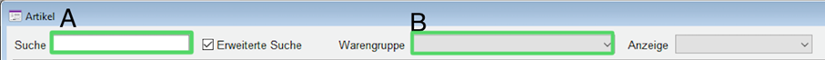
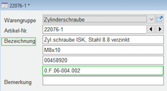

[Back to Home](../../README.md) / [1.7 Workshop](1.7-workshop.md) / [ERP System](erp.md) / **Search Articles in Hyreka**

# Search an Item

1. Press `F6` or click on `Artikel -> Artikel`:  
2. Type in the search bar of the new window 
    **A:** You can search for an specific item
    **B:** You can search for item groups
    
    *Note on abbreviations used, dimension descriptions, notations and other:*

    - *When searching for screws, nuts, etc., these should be searched for with their dimensions.*
 
    | Abbreviation in the system    | Full Text                                          |
    | :---------------------------- | :------------------------------------------------- |
    | Zyl.schraube ISK              | Zylinderschraube mit Innensechskant                |
    | Zyl.schraube niedr. ISK       | Zylinderschraube niedriger Kopf mit Innensechskant |
    | Skschraube                    | Sechskantschraube                                  |
    | Schreib gr. Aussendurchmesser | Scheibe mit grossem Aussendurchmesser              |

   | Additional Hints:                  |                                            |
   | ---------------------------------- | ------------------------------------------ |
   | Sizes of screws                    | Example: M5x10 (diameter 5mm, length 10mm) |
   | Sizes of nuts, spring washers, ... | Example: M5 (diameter 5mm)                 |
   | You cannot use `Umlaute`           | Example: ä-ae, ö-oe, ü-ue                  |
   | You cannot use `ß`                 | ß-ss                                       |
   | You cannot use special symbols     | Ecample: m²-m_2, µF-uF                     |

3. View the storage location of an item:
   Either directly in the search window or if you want to check if the article is used in a project is used in a project, it must be selected with a double-click 
    