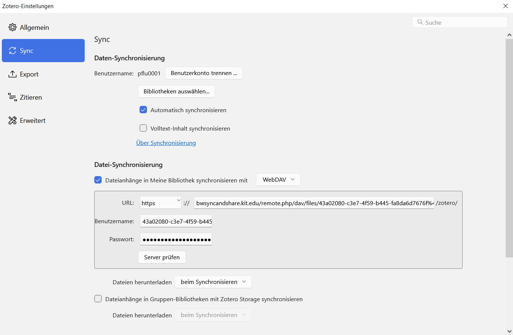

# <a href="/README.md"> Wiki </a>

## BW Sync&Share Registrierung
1. Jeder Mitarbeiter erhält 50 GB Speicherplatz vom Land. Der Desktop-Client ist bereits auf den HKA-Laptops installiert, sodass wir bequem Zotero-PDFs synchronisieren können - ohne Premium-Account. Registrierung erfolgt unter https://bwidm.scc.kit.edu/welcome/index.xhtml
2. [Anmeldung](https://bwsyncandshare.kit.edu/apps/files/) bei BW Sync&Share oder [Client](https://customerupdates.nextcloud.com/kk1eoZCTo0kI5HpGE3IT/) herunterladen.

## HKA Windows Image BWSync&Share Client Nextcloud einrichten
1. Bei bwsync&share im eingerichteten Standardbrowser einloggen
2. Nextcloud anwendung öffnen 
3. "Anmelden"
4. https://bwsyncandshare.kit.edu/ eingeben 
5. Im Browserfenster bestätigen und kurz warten
6. Synchonisierungseinstellungen vornehmen

## Zotero Datei-Synchronisierung mit BW Sync&Share
Info unter: https://www.zotero.org/support/sync
1. In Zotero: Bearbeiten → Einstellungen → Sync
2. Unter Dateianhänge in Meine Bibliothek synchronisieren mit "WebDAV" auswählen und WebDAV URL von BW Sync&Share einfügen.
3. WebDAV URL findet sich in BW Sync&Share unter Dateien → Dateien-Einstellungen (ganz unten links), kopieren und bei Zotero-Einstellungen einfügen.
4. Der geforderte Benutzername und das Passwort muss über BW Synch&Share generiert werden:
  - Klick auf eigenes Profil (ganz oben rechts) → Einstellungen → Sicherheit (links im Menü) → Geräte & Sitzungen
  - Beliebigen App-Namen eingeben und Neues App-Passwort erstellen, kopieren und bei Zotero-Einstellugen einfügen.
5.    
   Klick auf "Server prüfen", warten auf Bestätigung
